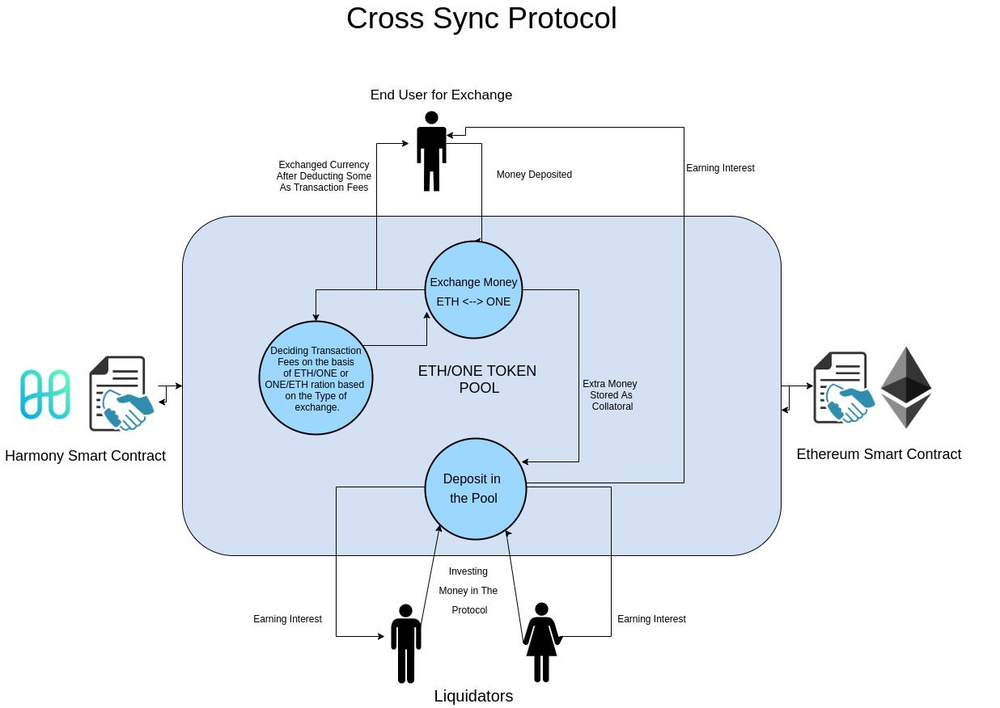

<h1><strong>Cross-Sync</strong> <h2>Connecting Blockchains</h2></h1>

-  Two Contracts Deployed, one on Ethereum and the other on Harmony.
-  "Liquidators" can come and invest in the "pool", either in ETH or ONE token.
-  User can come and deposit the amount + some overhead charges in ETH or ONE token to the respective contract, and correspoding amount is deposited to the other blockchain at the requested address.
-  The "overhead" charges that the exchanger pays, is used to give interest to the liquidity providers on the respective blockchains.
-  The "overhead" charges are decided by ETH/ONE or ONE/ETH ratio in the pool, depending upon the direction on exchange.

---

### Installation

-  Clone the Repository
-  `npm install`
-  Follow the following script guide:

| NPM Command                     | Action                                         |
| ------------------------------- | ---------------------------------------------- |
| npm run dev:iFrame              | Start the Iframe Injection dev server          |
| npm run dev:dashboard           | Start the dashboard dev server                 |
| npm run prod:iFrame             | Make the Iframe Production Build               |
| npm run prod:dashboard          | Make the dashboard Production Build            |
| npm run server                  | Start the backend server                       |
| npm run format                  | Beutify the codebase.                          |
| npm run prod:analyzeIframe      | Create Iframe bundle analyze report            |
| npm run prod:visualizeIfrme     | Create Iframe bundle visualize report          |
| npm run prod:compressIframe     | Make the Iframe Compressed Production Build    |
| npm run prod:analyzeDashboard   | Create Dashboard bundle analyze report         |
| npm run prod:visualizeDashboard | Create Dashboard bundle visualize report       |
| npm run prod:compressDashboard  | Make the Dashboard Compressed Production Build |

---

### Contract Addresses

-  **Harmony Testnet** : https://api.s0.b.hmny.io:

   -  Contract Address : 0x597265e930E9Bfe38364E0eD8f23d338F4a3aAcb

-  **Ethereum Testnet** : Rinkeby:

   -  Contract Address : 0x0ae59be94C1dd967e2eD2F7c2cF04388f0b4C362

---

### Problem

People and businesses in these countries face tremendous economic challenges, including:

-  Weak and volatile currencies that are not accepted globally, making it difficult for people and businesses in these countries to store value or initiate global transactions.
-  Limited access to foreign exchange, making it almost impossible to transact globally.
-  Poor access to banking services. More than 2 billion adults do not have a bank account (more than 80% of adults in Africa do not have a traditional bank account). Even those adults who are lucky enough to have a bank account, usually have limited access to Credit.

**Cross-chain interoperability, bridges, & stablecoins**

Harmony needs bridges between itself and Ethereum or Bitcoin, so that assets can freely flow. This means we need a way for assets from another chain to be minted/swapped on Harmony via some sort of bridge. Be creative here.

**Cross-border finance**

Being able to seamlessly send assets (money, etc.) on-chain from one country to another is one of the big opportunities for blockchain. For builders, consider integrating stablecoins with existing e-commerce plugins, cash-back reward systems, and integrations with in-country services or exchange partners.

<!--**UPI** -->
