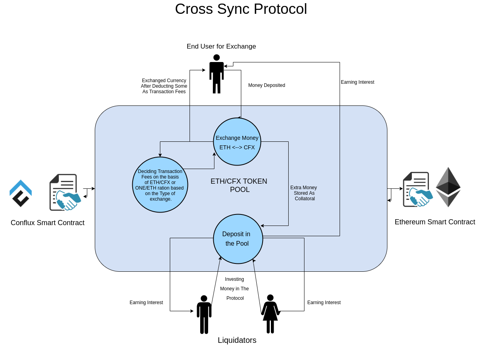
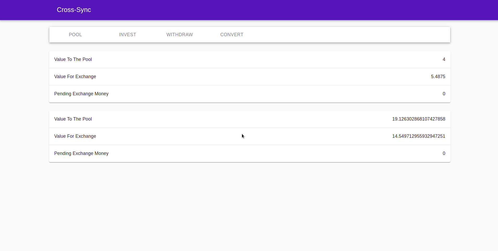
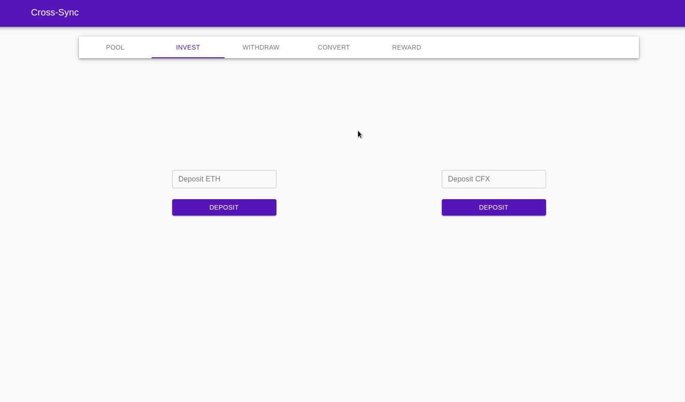
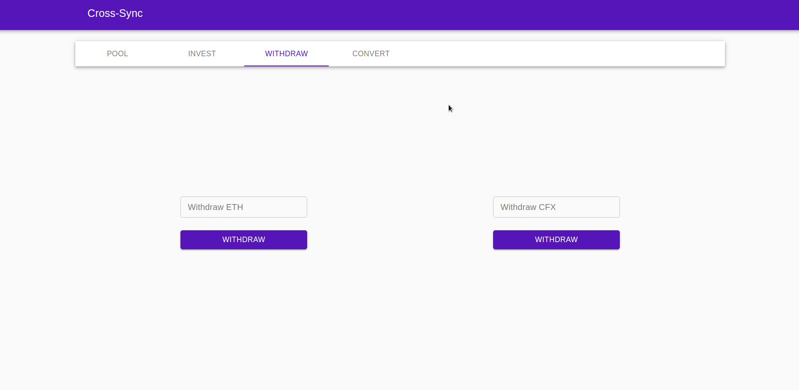
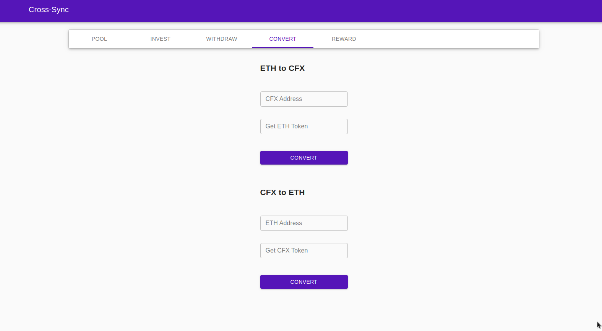
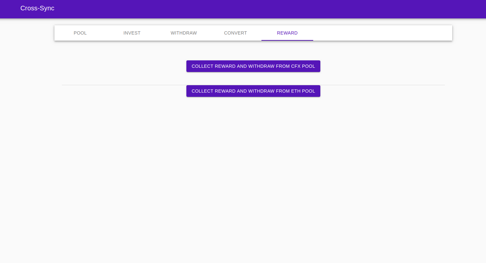

<h1><strong>Cross-Sync</strong> <h2>Connecting Blockchains</h2></h1>

[WIP]

-  Two Contracts Deployed, one on Ethereum and the other on Conflux.
-  "Liquidators" can come and invest in the "pool", either in ETH or CFX token.
-  User can come and deposit the amount + some overhead charges in ETH or CFX token to the respective contract, and correspoding amount is deposited to the other blockchain at the requested address.
-  The "overhead" charges that the exchanger pays, is used to give interest to the liquidity providers on the respective blockchains.
-  The "overhead" charges are decided by ETH/CFX or CFX/ETH ratio in the pool, depending upon the direction on exchange.

---

### Installation

-  Clone the Repository
-  `npm install`
-  Follow the following script guide:

| NPM Command                     | Action                                         |
| ------------------------------- | ---------------------------------------------- |
| npm run dev                     | Start the dashboard dev server                 |
| npm run prod                    | Make the dashboard Production Build            |
| npm run server                  | Start the backend server                       |
| npm run format                  | Beutify the codebase.                          |
| npm run prod:analyzeDashboard   | Create Dashboard bundle analyze report         |
| npm run prod:visualizeDashboard | Create Dashboard bundle visualize report       |
| npm run prod:compressDashboard  | Make the Dashboard Compressed Production Build |

---

Client Side Demo ( Rinkeby and Conflux Testnet ) : https://rachit2501.github.io/Cross-Sync-ConfluxHack/

### Contract Addresses

-  **Conflux Testnet** : http://testnet-jsonrpc.conflux-chain.org:12537:

   -  Contract Address : 0x856b5cd8177ba3876881b6fca0ef0ff7895d18f8

-  **Ethereum Testnet** : Rinkeby:

   -  Contract Address : 0xa165DC40178169856A7A08d77C7f612434F96952

---

TODO:

-  UI Improvements
-  Refactoring
-  ChainLink Integration for decentralized api calls (Cross-Sync V2)
-  Reward Claim Tab
-  Stabalizing the app and enhancing the protocol implementation.

### Screenshots

1. Your Pool Share:

2. Your Way to become a Liquidator:

3. Get back your funds:

4. Convert Your Funds Securely:

5. Grab Your Rewards

